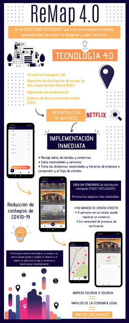

<div align="center" id="top"> 
  

  &#xa0;

  <!-- <a href="https://remap.netlify.app">Demo</a> -->
</div>

<h1 align="center">Remap 4.0</h1>

<p align="center">
  

  

  

  

  <!--  -->

  <!--  -->

  <!--  -->
</p>


 <h4 align="center"> 
	  🚧  Remap - Meica 🚀 Is in the <a href="https://play.google.com/store/apps/details?id=com.actg.meica&hl=en_US&gl=US">Play Store</a> but no longer mantained  🚧  
</h4> 

<hr> 

<p align="center">
  <a href="#dart-about">About</a> &#xa0; | &#xa0; 
  <a href="#sparkles-features">Features</a> &#xa0; | &#xa0;
  <a href="#rocket-technologies">Technologies</a> &#xa0; | &#xa0;
  <a href="#white_check_mark-requirements">Requirements</a> &#xa0; | &#xa0;
  <a href="#checkered_flag-starting">Starting</a> &#xa0; | &#xa0;
    <a href="#triangular_flag_on_post-project-structure">Project Structure</a> &#xa0; | &#xa0;
  <a href="#memo-license">License</a> &#xa0; | &#xa0;
  <a href="https://github.com/GonzaloAldana" target="_blank">Author</a>
</p>

<br>

## :dart: About ##

Proyecto presentado en Talent Hackathon @Home 2020, Festival Frena la Curva, España 2020 y Alibaba GET Global Challenge

Directorio inteligente que crea una experiencia urbana personalizada para surtir la despensa y cubrir servicios.  

Hecho por: Gonzalo Aldana, Andrea Aldana, Beatriz Trujillo y Genaro Aldana
## :sparkles: Features ##

:heavy_check_mark: Mapeo de comercios locales;\
:heavy_check_mark: Distribución de usuarios para evitar aglomeraciones;\
:heavy_check_mark: Creación de rutas para evitar mermas alimenticias;

## :rocket: Technologies ##

The following tools were used in this project:

- [Flutter 1.12.0](https://flutter.dev/)
- [MobX 1.2.1+4](https://pub.dev/packages/mobx/versions/1.2.1+4) Para el manejo de estados (Actualmente mi favorito es GetX)
- [Firebase](https://pub.dev/packages/firebase)

## :white_check_mark: Requirements ##

Before starting :checkered_flag:, you need to have [Git](https://git-scm.com) and [Flutter](https://flutter.dev/) installed and your project linked with a Firebase Instance.

## :checkered_flag: Starting ##

```bash
# Clone this project
$ git clone https://github.com/GonzaloAldana/remap

# Access
$ cd remap

# You need the google-services.json file

# Install dependencies
$ flutter pub get

# Run the project
$ flutter run
```

## :triangular_flag_on_post: Project Structure ##

* /atoms, /components: son lo básico de la interfaz

* /screens: son las pantallas

* /utils: cosas que comparte todo el proyecto

* La magia ocurre en /utils/functions.dart Ahí está el corazón del proyecto, toda la IA. Se implementa interpolación de matrices desde front, ya que fue un proyecto creado en poco tiempo sin el uso de servidores.
## :memo: License ##

This project is under license from MIT. For more details, see the [LICENSE](LICENSE.md) file.


Made with :heart: by <a href="https://github.com/GonzaloAldana" target="_blank">Gonzalo Aldana</a>

&#xa0;

<a href="#top">Back to top</a>
